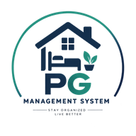

<div align="center">
  
  <h1>🏠 PG Management System</h1>
  <p><strong>Stay Organized • Live Better</strong></p>
  <p>A full-stack, role-based complaint and facility management web application designed for PG/Hostel owners, staff editors, and residents. Built using the <strong>MERN</strong> stack (MongoDB, Express.js, React, Node.js) with Vite, JWT authentication, and responsive design.</p>
</div>

---

## 🌟 Key Features & Role Capabilities

The system implements 3 distinct roles with role-based access control:

| Feature / Action | 👑 Owner | 🛠️ Staff Editor | 🏠 Tenant |
|---|:---:|:---:|:---:|
| **Create PG Account & Onboarding** | ✅ Yes | ❌ No | ❌ No |
| **Update PG Profile (Name, Address, Phone, Rules)** | ✅ Yes | ❌ No | ❌ No |
| **Staff Management (Invite Editors)** | ✅ Yes | ❌ No | ❌ No |
| **Accept Staff Invite (Mandatory on First Login)** | N/A | ✅ Yes | N/A |
| **View PG Account Details & Rules** | ✅ Yes | ✅ Yes (After invite accepted) | ✅ Yes |
| **Notice Board Management (Post/Delete Announcements)** | ✅ Yes | ✅ Yes (After invite accepted) | 👁️ Read Only |
| **Add / Enroll Tenants to Rooms** | ✅ Yes | ✅ Yes (After invite accepted) | ❌ No |
| **Register Complaints on Behalf of Tenants** | ✅ Yes | ✅ Yes (After invite accepted) | ❌ No |
| **Raise Personal Room/PG Complaint** | ❌ No | ❌ No | ✅ Yes |
| **View PG Complaints** | 👁️ All Complaints | 👁️ All Complaints | 👁️ Own Complaints Only |
| **Update Complaint Status (Pending → In Progress → Resolved)** | ✅ Yes | ✅ Yes (After invite accepted) | ❌ No |
| **Add Resolution Remarks & Timeline Audit** | ✅ Yes | ✅ Yes (After invite accepted) | 👁️ Read Only |
| **Dashboard Analytics & Filter Metrics** | ✅ Yes | ✅ Yes | 👁️ Personal Stats |

---

## 🗄️ Database Schemas (MongoDB / Mongoose)

### 1. `User` Schema
```javascript
{
  name: { type: String, required: true },
  email: { type: String, required: true, unique: true, lowercase: true },
  password: { type: String, required: true }, // Hashed with bcryptjs
  role: { type: String, enum: ['owner', 'editor', 'tenant'], required: true },
  pgId: { type: ObjectId, ref: 'PG' },
  inviteStatus: { type: String, enum: ['pending', 'accepted'], default: 'accepted' }, // For Editors
  roomNumber: { type: String }, // For Tenants (e.g. "204-B")
  phone: { type: String },
  invitedBy: { type: ObjectId, ref: 'User' },
  createdAt: { type: Date, default: Date.now }
}
```

### 2. `PG` Schema
```javascript
{
  name: { type: String, required: true },
  address: { type: String, required: true },
  ownerId: { type: ObjectId, ref: 'User', required: true },
  contactPhone: { type: String },
  rules: [{ type: String }],
  noticeBoard: [
    {
      title: String,
      message: String,
      priority: { type: String, enum: ['normal', 'urgent'], default: 'normal' },
      postedBy: { type: ObjectId, ref: 'User' },
      date: { type: Date, default: Date.now }
    }
  ],
  createdAt: { type: Date, default: Date.now }
}
```

### 3. `Complaint` Schema
```javascript
{
  title: { type: String, required: true },
  description: { type: String, required: true },
  category: { 
    type: String, 
    enum: ['Plumbing', 'Electricity', 'Wi-Fi', 'Cleaning', 'Food', 'Carpentry', 'Other'],
    required: true 
  },
  priority: { type: String, enum: ['Low', 'Medium', 'High', 'Urgent'], default: 'Medium' },
  status: { type: String, enum: ['Pending', 'In Progress', 'Resolved', 'Rejected'], default: 'Pending' },
  pgId: { type: ObjectId, ref: 'PG', required: true },
  tenantId: { type: ObjectId, ref: 'User', required: true },
  roomNumber: { type: String, required: true },
  registeredBy: { type: ObjectId, ref: 'User', required: true },
  registeredByType: { type: String, enum: ['tenant', 'staff'], default: 'tenant' },
  resolutionNotes: { type: String, default: '' },
  resolvedAt: { type: Date },
  timeline: [
    {
      status: String,
      note: String,
      changedBy: { type: ObjectId, ref: 'User' },
      changedByName: String,
      timestamp: { type: Date, default: Date.now }
    }
  ],
  createdAt: { type: Date, default: Date.now },
  updatedAt: { type: Date, default: Date.now }
}
```

---

## 🚀 Local Setup & Installation

### Prerequisites
- **Node.js**: v18 or newer
- **MongoDB**: A free MongoDB Atlas Connection URI or local MongoDB instance

---

### Step 1: Configure Backend (`server/`)

1. Open `server/.env`:
```env
PORT=5000
# Paste your MongoDB Atlas Connection String below:
MONGO_URI=mongodb+srv://<username>:<password>@cluster0.mongodb.net/pg_complaints?retryWrites=true&w=majority
JWT_SECRET=pg_complaint_management_secret_key_2026_super_secure
NODE_ENV=development
```

2. Install backend dependencies (from project root or `server/` directory):
```bash
cd server
npm install
```

3. Pre-seed the database with ready-to-test Demo Data (Optional but Recommended):
```bash
npm run seed
```

4. Start the backend API server:
```bash
npm run dev
# Server starts at http://localhost:5000
```

---

### Step 2: Configure Frontend (`client/`)

1. Open a new terminal tab and navigate to `client/`:
```bash
cd client
npm install
```

2. Start the Vite development server:
```bash
npm run dev
# Frontend runs at http://localhost:5173
```

3. Open `http://localhost:5173` in your browser.

---

## 🔑 Ready-to-Test Demo Credentials

For quick evaluation, the login page features **1-click credential buttons** or you can sign in manually:

| Role | Name | Email | Password | Details |
|---|---|---|---|---|
| **👑 Owner** | Vikram Malhotra | `owner@greenheights.com` | `password123` | Full access: PG Profile, Staff Management, Tenant enrollment, Complaint resolution |
| **🛠️ Staff Editor (Accepted)** | Sunil Sharma | `editor@greenheights.com` | `password123` | Active staff: can add tenants, register complaints on behalf of tenants, and update resolution |
| **⏳ Staff Editor (Pending)** | Amit Verma | `neweditor@greenheights.com` | `password123` | **Demonstrates Invite Acceptance flow**: prompted to accept invite on first login |
| **🏠 Tenant 1** | Rahul Deshmukh | `rahul@greenheights.com` | `password123` | Room 204-B: can raise complaints, see timeline |
| **🏠 Tenant 2** | Priya Nambiar | `priya@greenheights.com` | `password123` | Room 305-A: can raise complaints, see timeline |

---

## 📡 API Endpoints Reference

### 🔐 Authentication (`/api/auth`)
- `POST /api/auth/register-owner` - Register owner account and create a new PG
- `POST /api/auth/login` - Login for all roles (returns JWT token and user info)
- `GET /api/auth/me` - Fetch current user & PG details (Protected)

### 🏢 PG Operations (`/api/pg`)
- `GET /api/pg` - View PG details, notice board, rules (Owner, Accepted Editor, Tenant)
- `PUT /api/pg/profile` - Update PG name, address, contact phone, rules (**Owner ONLY**)
- `POST /api/pg/notices` - Post announcement on Notice Board (Owner & Editor)
- `DELETE /api/pg/notices/:noticeId` - Delete announcement (Owner & Editor)

### 👥 Staff Management (`/api/staff`)
- `POST /api/staff/invite` - Invite / add staff Editor (**Owner ONLY**)
- `GET /api/staff` - List all appointed staff editors and invite status (**Owner ONLY**)
- `PUT /api/staff/accept-invite` - Accept pending staff invite (**Editor ONLY**)

### 🏠 Tenant Management (`/api/tenants`)
- `POST /api/tenants` - Register/enroll new tenant to a room (Owner & Editor)
- `GET /api/tenants` - View all tenants with search by name/room (Owner & Editor)

### 🛠️ Complaint Management (`/api/complaints`)
- `GET /api/complaints/stats` - Summary counts (Total, Pending, In Progress, Resolved, Urgent)
- `GET /api/complaints` - List complaints (Tenant sees own; Owner/Editor see all in PG; supports status/category/priority filters)
- `POST /api/complaints` - Create complaint (Tenant for self; Owner/Editor on behalf of selected tenant)
- `GET /api/complaints/:id` - View single complaint details with audit timeline
- `PATCH /api/complaints/:id/status` - Update status (`Pending`, `In Progress`, `Resolved`, `Rejected`) & resolution notes (Owner & Editor)

---

## 🌐 Deployment Instructions

### 1. Push Code to Your GitHub Repository
```bash
git init
git add .
git commit -m "feat: PG Complaint Management System with 3 roles and invite acceptance flow"
git branch -M main
git remote add origin https://github.com/<your-username>/pg-complaint-management.git
git push -u origin main
```

### 2. Deploy Backend on Render
1. Create a free account on [Render](https://render.com).
2. Click **New +** → **Web Service** → Connect your GitHub repository.
3. Root Directory: `server`
4. Build Command: `npm install`
5. Start Command: `node src/server.js`
6. Under **Environment Variables**, add:
   - `MONGO_URI` = your MongoDB Atlas connection string
   - `JWT_SECRET` = any secret key string
   - `PORT` = `5000`

### 3. Deploy Frontend on Vercel
1. Create a free account on [Vercel](https://vercel.com).
2. Import your GitHub repository.
3. Root Directory: `client`
4. Framework Preset: `Vite`
5. Under **Environment Variables**, add:
   - `VITE_API_URL` = `https://<your-render-backend-url>.onrender.com/api`
6. Click **Deploy**.


<!-- PROMPTS I USED IN THIS PROJECTS -->
I need to build a full-stack PG Complaint Management System as an internship assignment.

Tech stack:
- React.js frontend
- Node.js + Express.js backend
- MongoDB + Mongoose
- JWT based authentication

The system should support three roles:
1. Owner
2. Editor/Staff
3. Tenant

Requirements:
- Owner can create a PG account.
- Owner can manage staff/editors.
- Owner and Editor can add tenants.
- Owner and Editor can create complaints on behalf of tenants.
- Owner and Editor can update complaint resolution status.
- Tenant can login, view PG details, create complaints and track complaint status.
- Editors must accept their invitation before accessing PG account data.
- Owner should have exclusive access to staff management and PG/account profile management.

First, don't write code.
Analyze these requirements and propose:
1. System architecture
2. MongoDB schemas
3. API structure
4. Authentication/authorization flow
5. React component/page structure
6. Folder structure
7. Important security considerations

Keep the architecture simple and suitable for an internship-level production-style project.